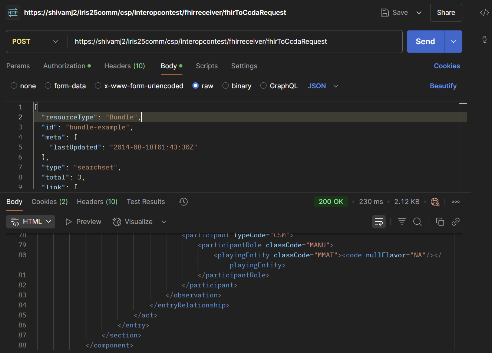
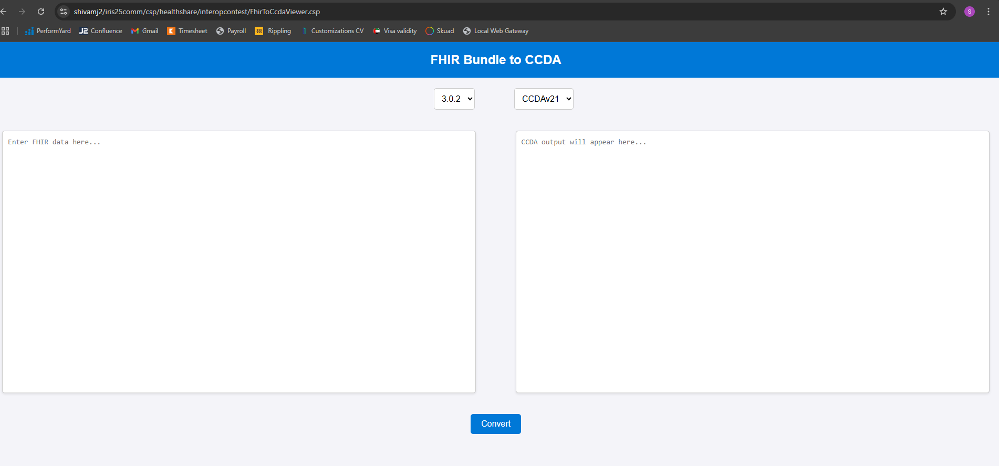
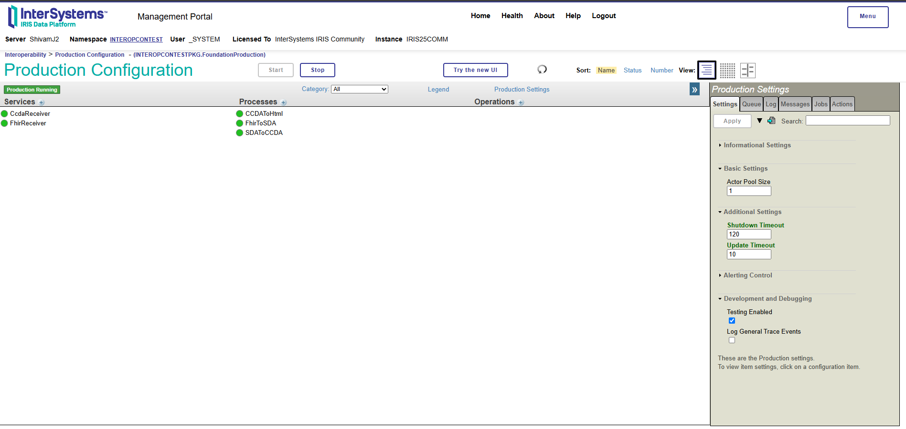
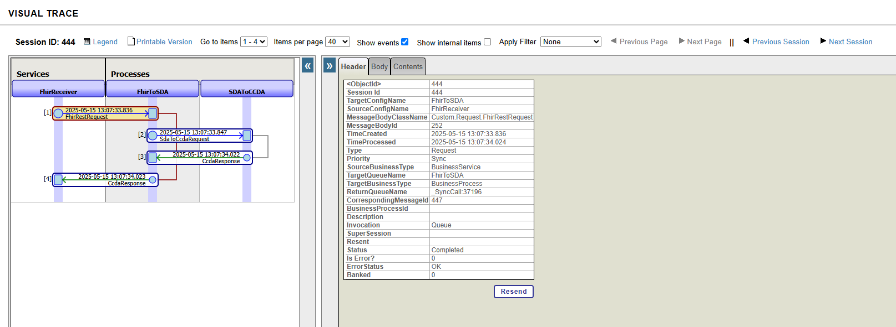
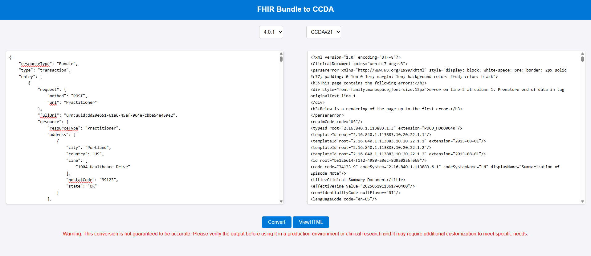
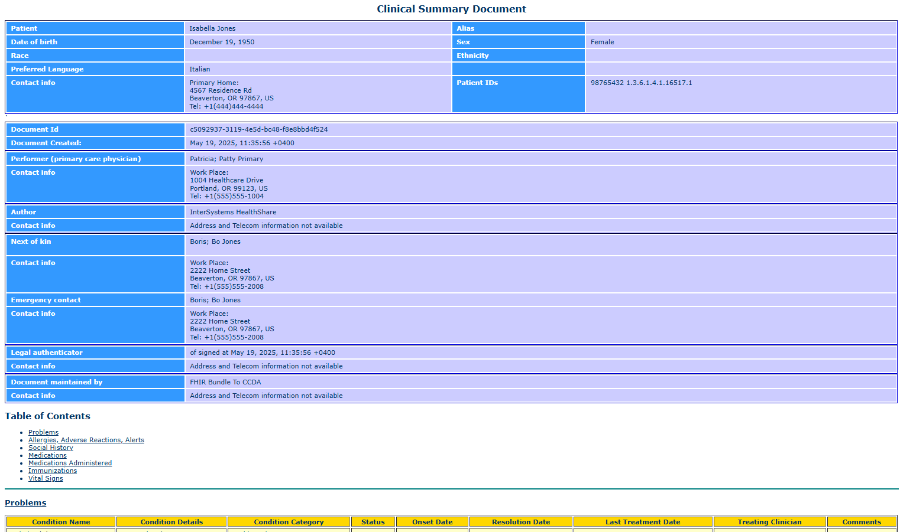

# InterOpContest

## Overview
InterOpContest(FHIR Bundle To CCDA) is a comprehensive project designed to facilitate interoperability between various healthcare data standards and formats. The project provides tools and services for converting, processing, and visualizing healthcare data, ensuring seamless integration and communication between different systems.

## Key Features
- **FHIR to CCDA Conversion**: Tools to convert FHIR (Fast Healthcare Interoperability Resources) data to CCDA (Consolidated Clinical Document Architecture) format.
- **CCDA to HTML Rendering**: Generate human-readable HTML views from CCDA documents.
- **SDA Transformations**: Support for transforming healthcare data using SDA (Structured Data Architecture) standards.
- **XSLT Stylesheets**: A collection of XSLT files for various data transformations, including FHIR, CCDA, and SDA.
- **RESTful APIs**: Expose functionality through REST APIs for easy integration with external systems.
- **UI Components**: User interfaces for visualizing and interacting with healthcare data.

## Project Structure
- **src/Custom/**: Contains the core logic for data processing, including operations, requests, responses, and services.
  - **FHIR/**: Modules related to FHIR data handling.
  - **Operation/**: Logic for processing and transforming data.
  - **Process/**: Classes for converting between formats like FHIR to SDA and SDA to CCDA.
  - **Request/**: Classes for handling incoming requests.
  - **Response/**: Classes for generating responses.
  - **Service/**: Services for receiving and processing data.
  - **UI/**: User interface components, such as the FHIR to CCDA viewer.

## Use Cases
- Healthcare organizations can use this project to convert FHIR bundle json and visualize clinical data in html format.
- Developers can integrate the provided REST APIs into their applications for seamless data interoperability for FHIR bundle to CCDA.
- Researchers can leverage the tools for analyzing and transforming healthcare data.

## Getting Started
1. Clone the repository.
2. Set up the required environment (IRIS for Health should be installed)
3. Open terminal, note: Intersystems Lite terminal on VS code have issues thus please use normal terminal
3. Import %ZBootstrap.mac file in the environment in %SYS namespace by using below command:

   w $System.OBJ.Import("cloned repo path\%ZBootstrap.mac","cuk")

4. Run below command to invoke the setup.
    do ^%ZBootstrap

    -- Choose 1 for complete setup 
    -- Once namespace is installed you will be prompted to enter src path on terminal 

   

    -- once file are imported it will automatically create the webapp

5. Now you are ready to go (note: i am using _SYSTEM:SYS as username password )
   
   API can be invoked from postman

   

   For using the UI application use link as below:
   ip:port/webprefix/csp/healthshare/interopcontest/FhirToCcdaViewer.csp

    

6. This project does use interoperability components which could be found in the production page and messages can be explored with Visual trace:

    

    

## sample testing

1. To perform a quick testing, use sample-test-patient.json.

2. Open application using below link:

ip:port/webprefix/csp/healthshare/interopcontest/FhirToCcdaViewer.csp

3. Copy the content, and paste it on text area for FHIR data. Choose version as 4.0.1 (This is essential as conversion will fail for 3.0.2)

4. After converting click on viewHTML to have a look at comprehensive data.

